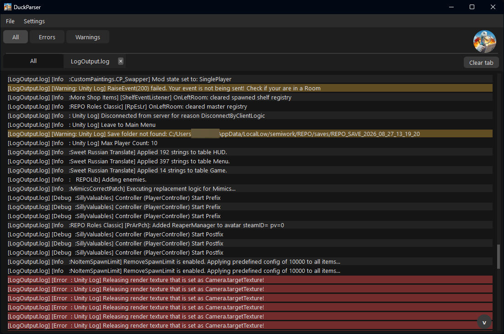

# DuckParser

A small desktop log viewer for people who stare at log files for a living.

Point it at a `.log` file and it keeps reading as the file grows, colours every
error red and every warning amber, and gives you a tab per file so you can watch
several at once. Nothing to configure, nothing to install alongside it.

It was written for Unreal and Unity game logs, but it does not care what
produced the file: the level of a line is decided by the words in the line
itself, so any plain-text log from any project works — a game build, a server,
a build script, a crash dump someone pasted into a `.txt`.



## What it does

**Live tailing.** The file stays open. New lines appear as they are written, so
you can leave DuckParser next to a running build or a running game and watch the
log fill up in real time.

**Errors and warnings, separated.** Three tabs across the top — `All`, `Errors`,
`Warnings`. A line is a warning if it contains "warning", an error if it
contains "error" or "fail", whichever word comes first. Errors and warnings also
stay colour-coded in the `All` tab, so you can spot them while scrolling
everything.

**Several files side by side.** Every opened file gets its own tab, and the
leftmost `All` tab merges all of them into one stream with the file name in
front of each line. Open two builds' logs and compare them without alt-tabbing.
Two files with the same name are fine — the second becomes `LogOutput.log (1)`.

**Right-click a file tab** to open its containing folder, or to close it. Hover
it to see where the file actually lives; how much of the path the tooltip shows
is up to you (`Settings → Tab path`: the full path, or just the last 2–5
folders).

**Search.** `Ctrl+F` opens a search box over the log. Enter or the arrows jump
between matches, and it wraps around at the ends.

**Jump back to context.** Right-click any error or warning in a filtered tab and
choose *Open in "All" log* — it switches to the `All` tab and scrolls to that
exact line, so you can read what happened around it.

**Clearing without losing anything.** `Clear tab` empties the current view but
keeps errors and warnings alive in their own tabs. `File → Clear all tabs`
wipes everything.

**Auto-scroll that gets out of the way.** The view follows the newest line until
you scroll up, then it stops and stays where you put it. A button in the corner
takes you back to the bottom.

**Themes and languages.** Dark and light themes; English, Russian and Ukrainian
interface. `Always on top` pins the window over the game or editor.

**It remembers.** Language, theme, and the files you had open are restored on
the next launch.

## Getting it

Grab the `.exe` from [Releases](../../releases) and run it. No installer, no
dependencies, no admin rights. Settings live in
`%APPDATA%\DuckParser\settings.json`, so the program never writes anything next
to itself — putting the `.exe` on your desktop leaves your desktop alone.

## Running from source

Requires Python 3.10+ and PySide6.

```
pip install PySide6
python app.py
```

Building the `.exe` yourself:

```
pip install pyinstaller
pyinstaller DuckParser.spec
```

The result lands in `dist/`.

## Tests

```
pip install pytest
pytest
```

The suite is deliberately small and checks the things that broke before:
level detection, the theme files, the settings location, and that every file
the build bundles actually exists.

## Layout

| Path | What lives there |
| --- | --- |
| `app.py` | Window, icon, entry point |
| `ui/` | Main window, tab bars, the log view widget |
| `parser/` | Level detection and the background file-tailing thread |
| `models/` | In-memory storage of parsed lines |
| `settings/` | Reading and writing `settings.json` |
| `localization/` | `en` / `ru` / `ua` strings |
| `themes/` | One stylesheet, two palettes |

## License

MIT — see [LICENSE](LICENSE).
